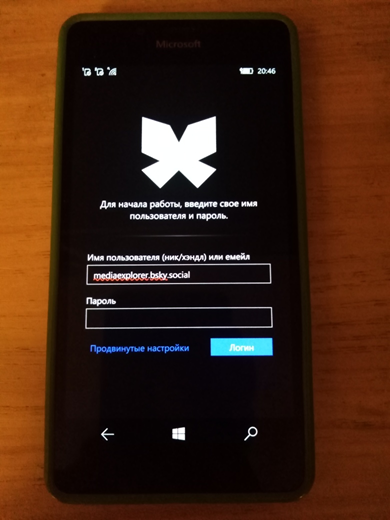
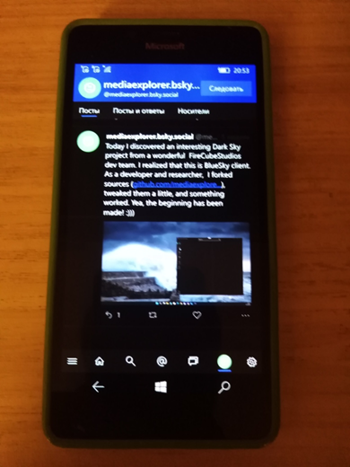

# Unisky


My fork of WamWooWam's UniSky project for some code patterns&devops micro-research...

## About
- A [Bluesky](https://bsky.app) client for Windows 10 & Windows 10 Mobile. 
- Built with [FishyFlip](https://drasticactions.github.io/FishyFlip/)

## Screenshot(s)



## Downloads (WamWooWam's Unisky app)
<a href="https://apps.microsoft.com/detail/9mxts7g6fchx?mode=direct">
	
</a>

See the [latest original release](https://github.com/UnicordDev/UniSky/releases)!

Requires Windows 10 build 15063 or later, please make sure your device is up to date!

## My 2 cents
- win sdk: 22000 to 19041 "downgrade" (for brave Win10-based host machine)
- Tests removed (yea, I'm very silly/stupid man in dev, and I hate to be tester)))
- Russian localization added

## Building
### Prerequisites
- Windows 10 22H1, Windows 11+
- Windows 10 SDK Build 19041
- Visual Studio 2022, with the Universal Windows Platform workload

### Building and Installing
Firstly, as with all GitHub projects, you'll want to clone the repo, but you will also need to pull submodules, to do this, use:

```sh
$ git submodule update --init --recursive
```

From here, building should be as simple as double clicking `UniSky.sln`, ensuring your targets are appropriate to your testing platform (e.g. Debug x64), and hitting F5. 


## Contributing
Unisky accepts contributions! Want a feature that doesn't already exist? Feel free to dig right in and give it a shot. Do be mindful of other ongoing projects, make sure someone isn't already building the feature you want, etc. If you don't have the know how yourself, file an issue, someone might pick up on it.

## References
- https://github.com/UnicordDev UnicordDev github page 
- https://github.com/UnicordDev/UniSky Original UniSky project
- https://drasticactions.github.io/FishyFlip FishyFlip library

## ..
As is. No support. Research mode , in general. DIY. 

## .
[m][e] 2024